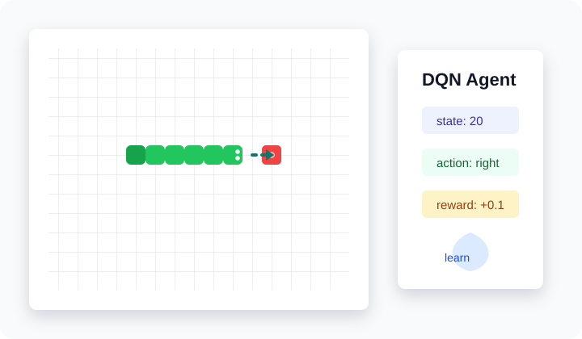

# 贪吃蛇 DQN 强化学习

<div align="center">
  
  
  
</div>

<p align="center">
  
</p>

这是一个轻量级的 DQN（Deep Q-Network）学习项目：用 PyTorch 训练一个智能体玩贪吃蛇，用 Pygame 展示训练和测试过程。项目刻意保持简单，适合用来理解强化学习里的状态表示、奖励设计、经验回放和 epsilon-greedy 探索。

## 特性

- 使用 PyTorch 实现基础 DQN
- 使用 Pygame 构建贪吃蛇环境和可视化
- 内置经验回放、目标网络、epsilon-greedy 策略
- 提供训练、可视化测试、无窗口评估三种入口
- 附带一个已训练模型 `best_snake_model.pth`
- 包含基础测试和 GitHub Actions，方便公开仓库协作

## 快速开始

### 安装依赖

```bash
pip install -r requirements.txt
```

### 训练模型

默认会打开 Pygame 窗口，适合观察训练过程：

```bash
python start_training.py
```

自动化或更快训练时，可以关闭游戏窗口并跳过确认：

```bash
python start_training.py --no-render --yes --episodes 1000 --fps 5000
```

常用参数：

- `--episodes`: 训练回合数，默认 `10000`
- `--fps`: 渲染帧率，默认 `2000`
- `--render_freq`: 每多少回合渲染一次，默认 `1`
- `--no-render`: 关闭训练过程中的 Pygame 渲染
- `--yes`: 跳过启动前确认

### 可视化测试

```bash
python test_snake_model.py --model best_snake_model.pth --episodes 5 --speed 10
```

保存测试统计图：

```bash
python test_snake_model.py --model best_snake_model.pth --episodes 10 --speed 10 --save_stats
```

### 无窗口评估

如果只想快速查看模型平均表现，不需要打开游戏窗口：

```bash
python evaluate.py --model best_snake_model.pth --episodes 100
```

输出示例：

```text
Model: best_snake_model.pth
Episodes: 100
Average score: 3.42
Max score: 11
Average steps: 148.20
Average reward: -4.73
```

具体数值会受随机种子和模型版本影响。

## 项目结构

```text
snake-dqn/
├── .github/workflows/ci.yml # 基础 CI
├── assets/                  # README 视觉资源
├── tests/                   # 轻量单元测试
├── snake_dqn.py             # 游戏环境、DQN 模型、训练循环
├── start_training.py        # 训练启动脚本
├── test_snake_model.py      # 可视化测试脚本
├── evaluate.py              # 无窗口模型评估脚本
├── quick_test.py            # 快速测试脚本
├── requirements.txt         # Python 依赖
├── best_snake_model.pth     # 已训练模型
└── README.md
```

## 算法说明

### 动作空间

智能体每一步只需要从 3 个动作中选择一个：

- `0`: 直行
- `1`: 右转
- `2`: 左转

### 状态表示

当前状态是一个 20 维向量，包含：

- 前方、右侧、左侧是否危险：3 维
- 当前方向：4 维
- 食物相对位置：4 维
- 蛇头坐标：2 维
- 食物坐标：2 维
- 蛇尾坐标：2 维
- 蛇身体中点坐标：2 维
- 蛇长度：1 维

### 网络结构

DQN 使用三层全连接网络：

```text
20 -> 128 -> 128 -> 3
```

输出的 3 个值分别表示三个动作的 Q 值。

### 奖励设计

- 靠近食物：`+0.1`
- 远离食物：`-0.1`
- 吃到食物：`+10`
- 撞墙或撞到自己：`-50`
- 原地打转：`-1`

这些奖励不是唯一正确答案，只是一个便于学习和实验的起点。你可以从这里开始修改奖励函数，观察智能体行为如何变化。

## 运行测试

```bash
python -m unittest discover -s tests
```

测试覆盖了几类基础行为：

- 状态向量维度固定为 20
- 食物不会生成在蛇身上
- 撞墙会结束回合
- 仓库自带模型可被加载

## 已训练模型

仓库附带 `best_snake_model.pth`，它对应当前 20 维状态表示和三动作输出。由于强化学习训练存在随机性，不同机器、不同 episode 数和不同随机种子下的分数会有波动。

如果你改了状态表示或网络结构，需要重新训练模型，否则旧 checkpoint 可能无法加载。

## 许可证

本项目基于 MIT 许可证发布，详见 [LICENSE](LICENSE)。

## 联系方式

- GitHub: [IMBALDY](https://github.com/IMBALDY)
- Email: 873312124@qq.com
